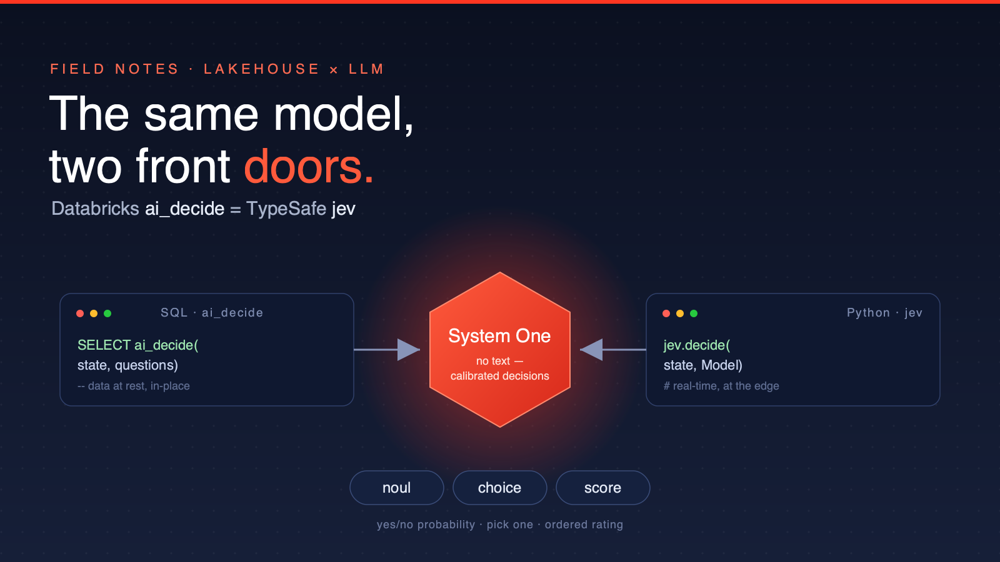
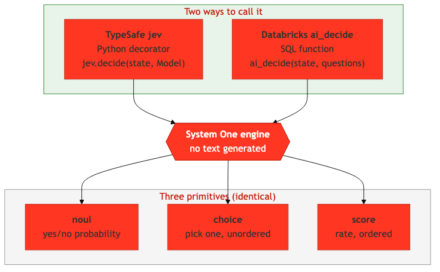
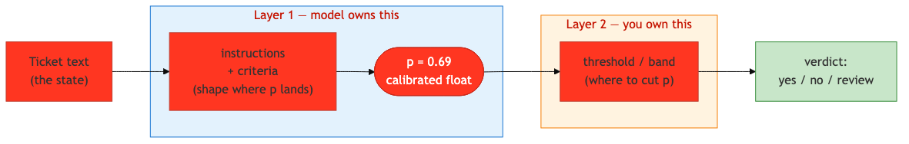
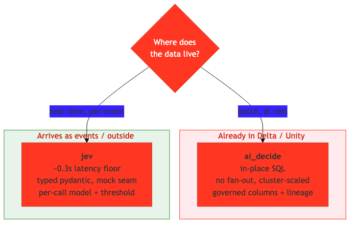
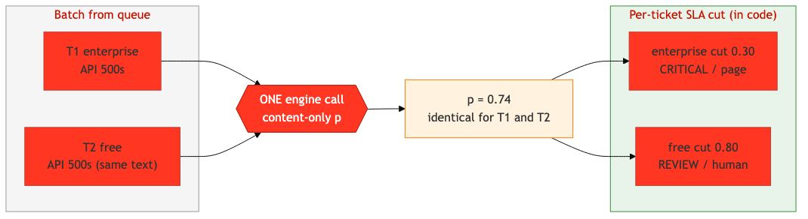

<!-- Medium-compatible: tables converted to lists -->

# Databricks `ai_decide` and TypeSafe's `jev` Are the Same Model — Here's When to Use Which

*I ran the identical classification spec through both. The answers matched. The question that remains isn't "which is smarter" — it's "where does your data live?"*



---

## The realization nobody told me about

I was evaluating [TypeSafe's `jev`](https://pypi.org/project/jev/) — a neat little Python library that turns a function signature into a structured LLM decision. No prompt strings, no JSON schema to babysit: you declare a Pydantic return model, and each field becomes a typed question. The model answers with calibrated probabilities and **generates no free text at all**.

Then I opened the Databricks SQL docs for [`ai_decide`](https://docs.databricks.com/aws/en/sql/language-manual/functions/ai_decide) and did a double take. Same three question types. Same request shape. Same response fields.

They are the **same engine** — TypeSafe's "System One" model — exposed two ways: a Python SDK (`jev`) and a SQL function (`ai_decide`).


*`jev` and `ai_decide` are two front doors to the same System One engine. The three primitives — noul, choice, score — are identical.*

So the interesting question was never "which gives better answers." I measured that too (they agree). The real decision is **operational**: latency, scale, cost, and above all — **where your data already lives.**

---

## What you'll learn

- **The 2-minute summary** — Executives, architects (*2 min*)
- **How the model actually works** — Developers (*6 min*)
- **The benchmark: do they agree?** — Developers, data teams (*4 min*)
- **The deciding factor: data gravity** — Architects (*3 min*)
- **Worked example: SLA-aware routing** — Developers (*5 min*)

---

## For executives: the 2-minute summary

You do not have to choose a different *model* for Python apps vs. your lakehouse. It's **one model, two interfaces**:

- **`ai_decide`** is a SQL function. If your data is already in Delta / Unity Catalog, you classify it **in place** — no export, no new service, results land as governed columns.
- **`jev`** is a Python library. If decisions happen on a live request path (a queue consumer, a webhook, an app), it gives you **sub-second latency** and typed objects.

**Without this insight:** teams stand up a separate inference service, export data to it, and reconcile two "AI vendors."

**With it:** one engine, picked by delivery context. Batch at rest → `ai_decide`. Real-time at the edge → `jev`. Same semantics, so a hybrid is safe.

> **Executive action item:** if you're already on Databricks, your structured-decision workloads over tables need no new infrastructure — it's a SQL function.

---

## For developers: how the model actually works

The whole model is **three primitives**. Every decision field is one of them:

- **noul** — a yes/no question → one calibrated probability `p ∈ [0,1]`. No separate confidence; `p` *is* the certainty.
- **choice** — pick one from an **unordered** set → the winning label + full distribution + confidence.
- **score** — rate along an **ordered** spectrum → an expected value (can land between levels) + confidence.

The subtle part is the noul, and it's where most of the "why did it decide that?" confusion lives. There are **two layers**, owned by two different parties:


*The model owns where `p` lands (shaped only by your wording). You own where to cut `p` into a verdict.*

**Layer 1 — the model emits `p`.** You can't dial a confidence number. You *influence* `p` only through the question's `instructions` and `criteria`: a sharp, concrete question pushes `p` toward 0 or 1; a vague one leaves it near 0.5.

**Layer 2 — you cut `p`.** A single threshold turns `p` into a bool. A *band* turns it into three outcomes — and this is the pattern worth stealing:

```python
def verdict(p, yes=0.8, no=0.2):
    if p >= yes:  return "yes"      # confident
    if p <= no:   return "no"       # confident
    return "review"                 # uncertain -> route to a human
```

That's it. The model gives you a calibrated float; you decide the policy.

Here's the same decision expressed both ways. In `jev`, the Pydantic model *is* the schema:

```python
from typing import Literal
from pydantic import BaseModel, Field
import jev

class Triage(BaseModel):
    department: Literal["billing", "technical", "sales"]
    is_urgent: bool
    severity: int = Field(ge=1, le=5)

triage = jev.decide("I was charged twice and want a refund!", Triage)
```

In `ai_decide`, the questions are JSON and the answer is a `VARIANT` column:

```sql
SELECT ai_decide(
  'I was charged twice and want a refund!',
  '{
    "department": {"type": "choice", "instructions": "Which team?",
      "criteria": {"billing": "Payments", "technical": "Bugs", "sales": "Pricing"}},
    "is_urgent": {"type": "noul", "instructions": "Needs a fast response?"},
    "severity": {"type": "score", "instructions": "Rate severity",
      "criteria": ["Trivial","Minor","Moderate","Serious","Critical"]}
  }'
) AS decision;
```

Same questions, same answers — one returns a typed object, the other a column.

---

## The benchmark: do they actually agree?

I built one neutral spec and ran it through **both** engines — six long-form support tickets, six questions each (2 choice, 2 noul, 2 score).

**Exact agreement: 25/36 (69%).** But that headline undersells it:

- **Hard labels agreed perfectly.** `category` 6/6, `requires_human` 6/6.
- **Scores agreed within ±1 on every case** (6/6) — same ranking, ±1 notch of sampling noise.
- **The only real divergence was one noul: `is_urgent`.** On borderline tickets (an account lockout, a sales inquiry, a GDPR request) `ai_decide` returned ~0.80–0.99 while `jev` returned ~0.20–0.29.

That gap is **not** a bug or a capability difference. It's **calibration**: `ai_decide` ran hotter on urgency, `jev` more conservative. And `jev`'s 0.20–0.29 values sit squarely in the "route to human review" band — the model honestly signalling *uncertain*. The fix is threshold tuning, not treating one engine as wrong.

**Takeaway:** pick on delivery, not accuracy. On the substance, they're the same model.

---

## The deciding factor: data gravity


*The single most useful question: where is the data right now?*

### Data already in Databricks → `ai_decide`

If the rows are in a Delta table, `ai_decide` is almost always right:

- **No data movement.** Nothing leaves the lakehouse boundary — no egress, no PII crossing to an external API.
- **No fan-out orchestration.** One SQL job instead of a client looping millions of HTTP calls with retries, backoff, and rate-limit handling.
- **Scales with the cluster.** It's a distributed op; add workers to raise throughput — no per-request ceiling.
- **Results are first-class data.** Output columns join to the source, feed pipelines, and carry **Unity Catalog lineage and governance**.

### Data at the edge / real-time → `jev`

If content arrives as events and you act *now*: `jev`'s ~0.3s per-call latency beats a warehouse spin-up, and you get typed Pydantic objects, a mock seam for tests, and per-call control of model and threshold.

### What the performance numbers say

On a small serverless warehouse (one noul), measured end-to-end:

- **`ai_decide`:** ≈ 6s fixed + 0.52s/row (~1.9 rows/s on this small warehouse).
- **`jev`:** ≈ 0.3s per call, ~0.09s/item batched (~11 rows/s).

On *this* warehouse, `jev` was faster at every batch size from 1 to 100,000 — **no crossover.** But read that carefully: `ai_decide` is distributed, so its per-row cost drops ~linearly with cluster width. The crossover is `0.52s / parallelism < 0.09s` — `ai_decide` wins once the cluster is ~6×+ wider **and** the batch is large enough to amortize the fixed cost. Meanwhile `jev`'s flat rate is bounded by API concurrency, rate limits, and payload caps at sustained volume.

**So: latency → `jev`. Raw throughput over data at rest, on a sized cluster → `ai_decide`.**

---

## Worked example: SLA-aware routing from a queue

Here's where it gets practical. Support tickets arrive from a message queue. The **same ticket text** should be more critical for an enterprise customer than a free one. How do you encode that *without* re-querying the model per tier?


*The model judges content only (one call). SLA is applied as a per-ticket threshold in code.*

The trick: **keep the model SLA-blind.** It emits one content-only probability per ticket. The SLA selects the *cut point* — in code, after the call:

```python
SLA_CUTS = {                       # (critical_at, review_at)
    "enterprise": (0.30, 0.15),    # strict SLA: escalate readily
    "business":   (0.50, 0.30),
    "free":       (0.80, 0.50),    # only strong signals page anyone
}

def route(sla, p):
    crit, review = SLA_CUTS[sla]
    if p >= crit:   return "CRITICAL  -> page on-call"
    if p >= review: return "REVIEW    -> human queue"
    return                 "ROUTINE   -> auto-ack / backlog"
```

Two identical tickets, different SLA → **identical `p`**, different route. I verified this live on both engines: `jev` and `ai_decide` returned the same probability for the duplicated ticket, and the SLA cut did the rest.

Why put SLA at the cut and not in the prompt?

- **In the prompt:** `p` shifts opaquely, the same text scores differently, and it's hard to audit.
- **At the threshold:** `p` stays content-only and reusable, criticality is a deterministic business rule you can change without re-querying, and it's auditable.

Bonus: because `p` is SLA-blind, you **query once** and can re-threshold for any tier — or add a new tier — with **zero** extra model calls. That matters when you're paying per call *and* running a high-volume queue.

---

## Try it yourself

**Path 1 — offline (no API, 2 min).** The example repo ships a keyword-heuristic stub so you can see the routing logic without spending anything:

```bash
git clone https://github.com/LaurentPRAT-DB/Jev_test1.git
cd Jev_test1/examples/sla_queue
python run.py            # stub backend, no credit
python -m pytest test_router.py -q
```

**Path 2 — live `jev` (1 batched call).** Set `TYPESAFE_API_KEY`, then `python run.py --engine jev`.

**Path 3 — live `ai_decide`.** On Databricks (DBR 15.4+), `python run.py --engine ai_decide` against your SQL warehouse profile.

---

## Common gotchas

**"The noul is always 1 or 0."** No — the engine returns a continuous float. 1/0 only appears *after you threshold it*. Keep it raw and it stays `0.69`.

**"`jev.decide(bool_threshold=…)` gives per-question cuts."** It doesn't — it's one global value for every bool field in the call. For per-question cuts, read the raw probabilities and threshold each field yourself.

**"`str` fields in my model."** Rejected at decoration time. The model generates no text, so fields must be `bool`, `Literal`/`Enum`, or `int`/`float` with `Field(ge=…, le=…)`.

**Tables in Medium.** (Meta-gotcha for this article.) Medium renders markdown tables as plain text — convert to bullet lists before importing.

---

## Resources

- **Example repo (all code + benchmarks):** https://github.com/LaurentPRAT-DB/Jev_test1
- **`jev` on PyPI:** https://pypi.org/project/jev/
- **Databricks `ai_decide` docs:** https://docs.databricks.com/aws/en/sql/language-manual/functions/ai_decide
- **TypeSafe:** https://typesafe.ai

---

## About the author

I work in field engineering at Databricks, where I spend a lot of time at the seam between the lakehouse and the application layer. This piece came out of a genuine "wait, these are the same thing?" moment — and the realization that the right answer usually comes down to where the data already lives.

---

**Did this help?** Give it a clap and follow for more field notes from the lakehouse.

*Tags: #Databricks #LLM #DataEngineering #MachineLearning #AI*
